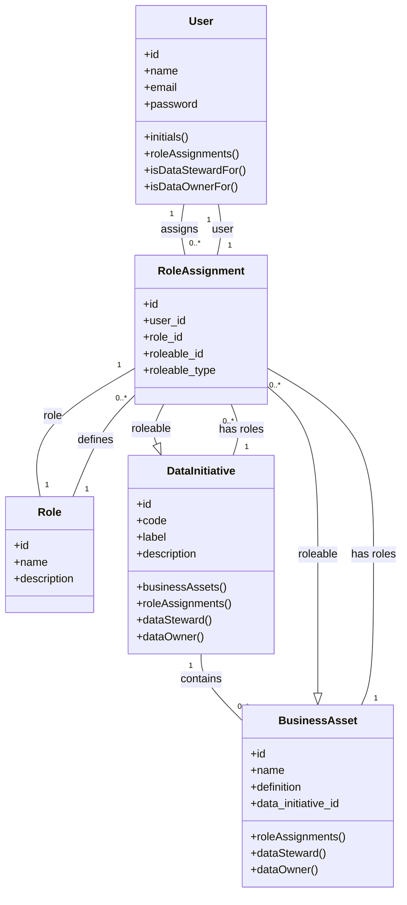

# Katalogos

Katalogos is an open-source **data governance platform** designed to help organizations manage their data assets, initiatives, and stewardship responsibilities. Built on Laravel, Katalogos provides a structured approach to data cataloging, role assignments, and governance workflows.

## About

Katalogos addresses the critical need for **business value-oriented data governance** by:

- **Centralizing data asset inventory** - Track and document all your data assets in one place
- **Managing data initiatives** - Organize data projects and programs with clear ownership
- **Defining roles and responsibilities** - Assign Data Stewards and Data Owners to ensure accountability
- **Enabling traceability** - Maintain clear lineage between business assets and data initiatives

As an open-source solution, Katalogos can be customized to fit your organization's specific governance requirements while maintaining industry best practices.

## Data Model



### Key Relationships

- **User ↔ RoleAssignment ↔ Roleable (polymorphic)**: Users are assigned roles on entities via the polymorphic `role_assignments` pivot table
- **DataInitiative → BusinessAsset**: A DataInitiative contains many BusinessAssets (one-to-many)
- **Polymorphic Roles**: The same Role model can be assigned to any entity type (currently DataInitiative and BusinessAsset)

## Getting Started

### Prerequisites

- PHP 8.3+
- Composer 2.x
- Node.js 18+
- SQLite (default) or MySQL/PostgreSQL

### Installation

1. Clone the repository:
   ```bash
   git clone https://github.com/your-org/katalogos.git
   cd katalogos
   ```

2. Install dependencies:
   ```bash
   composer install
   npm install
   ```

3. Set up environment:
   ```bash
   cp .env.example .env
   php artisan key:generate
   ```

4. Run migrations and seeders:
   ```bash
   php artisan migrate --seed
   ```

5. Build frontend assets:
   ```bash
   npm run build
   ```

### Running the Application

#### Development
Start the development server with all services:
```bash
composer run dev
```

This starts:
- Laravel development server
- Queue listener
- Log viewer (Pail)
- Vite dev server

Access the application at `http://localhost:8000`

#### Production
For production, ensure you have:
- Proper `.env` configuration
- Database connection configured
- Queue worker running
- Frontend assets built with `npm run build`

## Running Tests

Katalogos uses Pest for testing with PHPUnit compatibility:

```bash
# Run all tests
php artisan test

# Run specific test file
php artisan test --filter RoleAssignmentTest

# Run with coverage
php artisan test --coverage
```

The test suite includes:
- Feature tests for API endpoints
- Feature tests for role assignments
- Authentication tests
- Authorization tests

## Code Quality

```bash
# Run linter
composer run lint

# Check lint without fixing
composer run lint:check

# Run static analysis
composer run types:check

# Run full CI check
composer run ci:check
```

## Contributing

We welcome contributions! Please follow these steps:

1. Fork the repository
2. Create a feature branch (`git checkout -b feature/amazing-feature`)
3. Make your changes
4. Run tests and linting (`composer run ci:check`)
5. Commit your changes (`git commit -m 'Add amazing feature'`)
6. Push to the branch (`git push origin feature/amazing-feature`)
7. Open a Pull Request

### Development Workflow

- Follow PSR-12 coding standards
- Write tests for new features
- Keep commits atomic and well-described
- Update documentation as needed

## License

Katalogos is open-sourced software licensed under the [MIT license](LICENSE).
